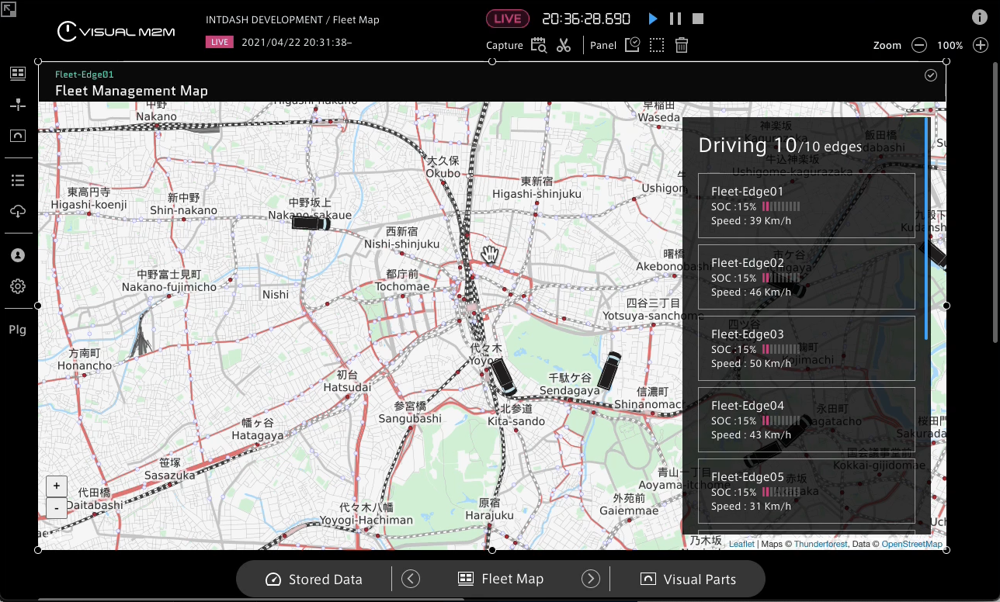

# visual-parts-fleet-map

Fleet Map デモを想定したサンプル Visual Parts です。

当サンプルプロジェクトは、2021/4/26に公開されたテックブログ記事に関連する情報提供を目的として公開しています。  
現在の最新バージョンでの動作保証はいたしかねますのでご了承ください。  

### 完成図



### ディレクトリ構成

```
src
  - assets
    - images
     - fleet-map
       - th-fleet-map@3x.png  ....... サムネイル画像を準備します
  - entrypoint
    - fleet-map
      - parts ....................... View のReactサブコンポーネントを実装します
        - bar-sub-division-meter
        - car-maker
        - map-zoom-controller
        - scrollbar
      - selector
        - props-selector.ts ........ Visual Parts SDK のデータから View の Component Props に変換します
      - component.tsx .............. View のReactコンポネントを実装します
      - container.tsx .............. Visual Parts SDK と Fleet Map Component を連結します
      - index.ts ................... ビジュアルパーツ Fleet Map を定義します
      - extension.tsx .............. ビジュアルパーツ固有の定義、及びPanel Option を定義します
      - utils.ts ................... ヘルパーを実装します
    - index.ts ..................... エントリポイントの定義します (複数のビジュアルパーツを実装する場合はここにimportの行を追加します)
```    
